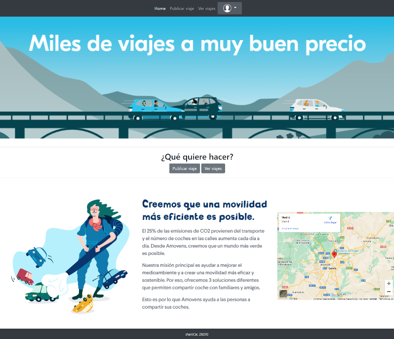

# ShareCar
Este proyecto va sobre una web para compatir coche. En el cuál, sus principales funciones serán crear datos, leer datos, actualizar datos y borrar datos (CRUD). 

# Antes de comenzar
Antes de comenzar y importante aclarar que no es una página web real, es un proyecto creado para el módulo de Desarrollo web en entorno servidor y con parte para la asignatura de Despliegue de aplicaciones web de segundo de ciclo de Desarrollo de aplicaciones web.

# Página principal



# Instalación
1. El primer para es clonar el repsitorio de la siguiente manera:
```
git clone https://github.com/SaraMarrero/ShareCar.git
```

2. El segundo paso es crear la base de datos, el archivo de la base de datos está en la siguiente ruta:
```
data/bbdd.sql
```

 Puede instalarla por medio del xampp, solo tiene que activar mysql, entrar en shell con 'mysql -u root' y ahí copiar los datos del archivo que acabo de mencionar.

3. El tercer paso es crear el archivo '.env' en el cuál tendrá que crear las variables de entorno para poder conectarse con la base de datos ya creada, se debe mostrar así:
```
DB_HOST = 'localhost'
DB_USER = 'root'
DB_PASS = ''
db_name = 'sharecar'
```

4. El cuarto paso es tener activado apache y mysql en xampp, y ejecutar desde el directorio raíz el siguiente comando:
```
php -S localhost:8000
```

5. El quinto y último paso es ejecutar en el navegador la siguiente ruta:
```
http://localhost:8000
```

# Uso de la aplicación
## Usuario sin cuenta


## Usuario con cuenta


## Administrador

# Autora
* Sara Marrero Miranda

# Documentación
